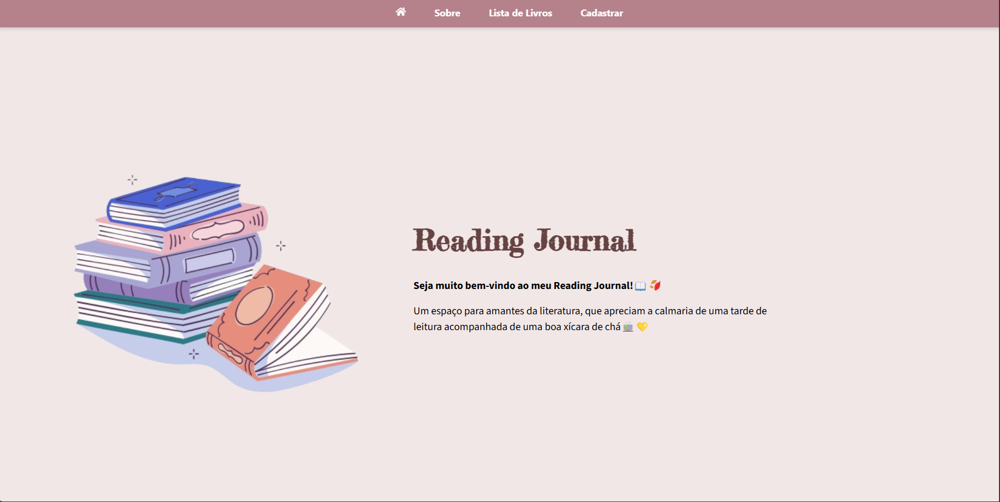
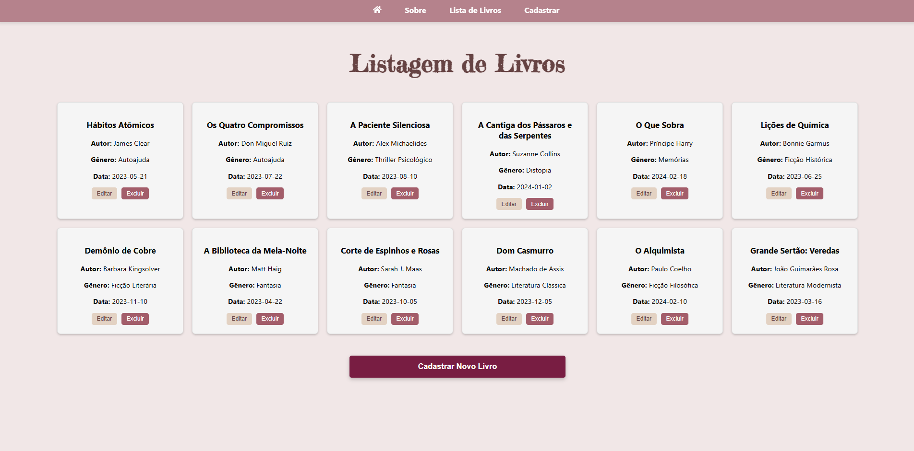
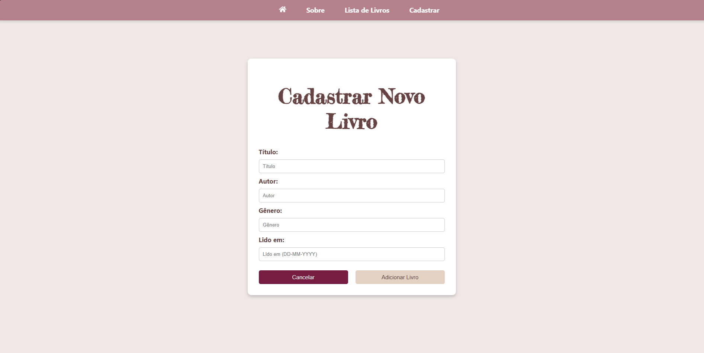

# Nome: `Nicole Saenger Soares`

## Projeto Fase 2 - CRUD para Reading Journal📚 

Este projeto é um CRUD (Create, Read, Update, Delete) de livros desenvolvido com **React.js** para a disciplina de **Desenvolvimento de Sistemas Frontend**.
<br><br>
Na segunda fase deste projeto, reutilizei a interface estática desenvolvida na primeira fase, aprimorando a aplicação com uma navegação mais fluída e interativa. A navegação entre as páginas foi implementada com **React Router**, permitindo transições dinâmicas e uma melhor organização das diferentes seções do app. Além disso, a interface foi aprimorada com a utilização de bibliotecas de UI, como **Material-UI**, para estilização de componentes e **Axios** para consumir dados de uma **API REST** fornecida pela universidade.

<br><br>

## 🛠️ Para o desenvolvimento do CRUD, utilizei as seguintes tecnologias:
- **React.js** ⚛️ – Biblioteca principal para construção da interface do usuário. O React foi utilizado para criar componentes reutilizáveis, gerenciar o estado da aplicação e renderizar dinamicamente as páginas, facilitando a navegação entre os diferentes componentes do projeto.
  
- **JavaScript** 💻 – Linguagem de programação utilizada para a lógica de funcionamento do CRUD, manipulando dados, realizando as requisições HTTP e implementando a navegação entre as páginas.

- **CSS** 🎨 – Responsável pela estilização da aplicação. Utilizei CSS para garantir uma interface visual atraente e responsiva, criando uma experiência de usuário consistente e fluida.

- **Axios** 📡 – Biblioteca para realizar requisições HTTP à API REST. Com o Axios, foi possível consumir dados da API, realizando operações CRUD como criar, ler, atualizar e deletar livros na base de dados.

- **Jest** 🃏 – Framework de testes utilizado para garantir que os componentes e funcionalidades da aplicação estivessem funcionando corretamente. O Jest foi utilizado para realizar testes unitários e funcionais, verificando, por exemplo, se os componentes renderizavam corretamente e se as interações com a API estavam sendo feitas da maneira certa.

- **React Router DOM** 🛣️ – Biblioteca utilizada para implementar a navegação entre as páginas da aplicação. Com o React Router, foi possível criar rotas dinâmicas, permitindo que o usuário navegasse entre diferentes views, como a listagem de livros, cadastro, edição e página informativa.

- **Material-UI (MUI)** 🌈 – Biblioteca de componentes de interface baseada em Material Design, usada para estilizar e criar componentes UI modernos e responsivos. Utilizei componentes como botões, campos de texto, menus e ícones para construir uma interface consistente e agradável.

- **React Icons** 🔍 – Biblioteca utilizada para incluir ícones vetoriais personalizáveis em componentes React. Os ícones foram usados para tornar a interface mais intuitiva, representando visualmente ações da aplicação.

- **Babel** 🔧 – Ferramenta para transpilar o código JavaScript moderno (ES6+) para versões compatíveis com navegadores mais antigos. O Babel foi utilizado para garantir a compatibilidade do código com diversos ambientes de execução, além de permitir o uso das funcionalidades mais recentes do JavaScript.

<br>

---

<br>

## 🤔 O que você encontrará na aplicação?

### 🏠 Página Inicial (Home) 
A **Página Inicial** é a porta de entrada para o Reading Journal. Ela apresenta uma visão geral do aplicativo e fornece acesso rápido às funcionalidades principais. A partir daqui, o usuário pode navegar para as outras páginas do site, como a lista de livros, a página informativa sobre o projeto, e a página de cadastro de novos livros.

<br>

### ℹ️ Página Sobre o Projeto
A Página **Sobre o Projeto** contém informações detalhadas sobre a motivação do projeto e as aplicações que o usuário encontrará nele.

<br>

### 📚 Página de Lista de Livros
A Página de **Lista de Livros** exibe todos os livros cadastrados no Reading Journal. Além de listar os livros provenientes da API e do formulário de cadastro, a página permite ao usuário interagir com as entradas, como editar ou excluir um livro. Também há um botão para "Cadastrar Novo Livro" que direciona o usuário para a página de cadastro.

<br>

### ✍️ Página de Cadastro de Livros
A Página de Cadastro de Livros permite que o usuário adicione novos livros ao Reading Journal. O formulário de cadastro solicita informações como título, autor, gênero e data em que o livro foi lido. Após preencher o formulário, o usuário pode adicionar o livro à lista e será automaticamente redirecionado para a Página de Lista de Livros.

<br>

---

<br>

## 🔧 Componentes da Aplicação

### 🌐 NavBar - Barra de Navegação
A **NavBar** é um componente responsável pela navegação entre as diferentes páginas da aplicação. Ele utiliza o **React Router** para redirecionar o usuário para as páginas principais, como a página inicial, sobre o projeto, lista de livros e cadastro de livros.

- **Links de navegação:** Através do componente <Link> do React Router, são criados links de navegação para as páginas principais: Home (/), Sobre (/info), Lista de Livros (/list) e Cadastro de Livros (/add).

- **Ícone Home:** Utiliza o ícone FaHome da biblioteca React Icons para representar visualmente a página inicial (Home).

- **Estilização de links:** Cada link é estilizado com a classe navBarLinks, que garante uma navegação visualmente consistente e agradável.

- **Estrutura de navegação:** Organiza os links dentro de uma lista não ordenada e cada item de navegação dentro de um item de lista, permitindo uma disposição clara e simples.
  
<br>

### 📚 BookList - Componente de Listagem de Livros
O **BookList** é um componente fundamental na aplicação, responsável por exibir a lista de livros cadastrados. Ele faz requisições à API para obter os livros, permite a edição de livros existentes e oferece a funcionalidade de excluir um livro. Além disso, o componente possui a opção de navegar para a página de cadastro de novos livros.

- **Busca de livros:** Utiliza o useEffect para buscar os livros da API assim que o componente é montado. A requisição é feita com Axios (GET), e a lista de livros é armazenada no estado books. Caso haja um erro, o estado error é atualizado.

- **Controle de carregamento:** Através do estado loading, é exibida uma mensagem de "Carregando livros..." até que a requisição à API seja concluída. Se não houver livros cadastrados ou ocorrer um erro, uma mensagem apropriada é exibida.

- **Edição de livros:** Se o usuário clicar no botão "Editar", o componente alterna para o modo de edição, exibindo o componente BookEdit para realizar as alterações. A edição é salva com uma requisição PUT à API, atualizando a lista de livros no estado books com os dados modificados.

- **Exclusão de livros:** Cada livro possui um botão "Excluir", que, ao ser clicado, envia uma requisição DELETE para a API para remover o livro. A lista de livros é então atualizada, removendo o livro excluído.

- **Navegação para cadastro de novo livro:** O botão Cadastrar Novo Livro leva o usuário para a página de cadastro, permitindo que ele adicione novos livros à lista. Isso é feito com a função handleNewBook, que usa o useNavigate do React Router para redirecionar para a página /add.

- **Exibição de dados:** Cada livro é exibido em um card com informações como título, autor, gênero e data de leitura.

<br>

### ✍️ BookEdit - Componente de Edição de Livros
O **BookEdit** é um componente que permite que os usuários editem os detalhes de um livro existente. Ele carrega as informações do livro a partir da API, exibe um formulário de edição com os campos já preenchidos, e possibilita a atualização desses dados. O componente também oferece a opção de cancelar a edição, retornando à tela de listagem.

- **Carregamento de dados do livro:** O componente utiliza o useEffect para buscar os dados do livro a partir do bookId (passado como prop). A requisição GET é feita à API para obter as informações do livro, e o estado editedBook armazena esses dados. Caso ocorra algum erro ou o bookId seja inválido, o componente exibe uma mensagem de erro.

- **Controle de edição:** O formulário é preenchido automaticamente com as informações do livro, como título, autor, gênero e data de leitura. Os campos de entrada são controlados, ou seja, suas mudanças são rastreadas e atualizadas no estado editedBook via onChange.

- **Edição de data de leitura:** A edição da data de leitura (campo readAt) é controlada separadamente através da função handleReadAtChange. Este método aplica uma validação simples de formato para garantir que a entrada esteja no formato correto de data (DD-MM-YYYY).

- **Envio e atualização:** Ao submeter o formulário (com o botão "Salvar"), é feita uma requisição PUT para a API com os dados atualizados do livro. O saveEdit, função passada como prop, é chamada com os dados do livro atualizado, o que permite a atualização da lista de livros na página anterior.

- **Cancelamento da edição:** Caso o usuário decida não salvar as alterações, ele pode clicar no botão "Cancelar", que invoca a função cancelEdit passada como prop, retornando o estado do componente BookList à sua versão inicial sem mudanças.

- **Exibição de erros:** Se ocorrer algum erro ao carregar os dados do livro ou ao fazer a requisição para salvar as edições, o componente exibirá uma mensagem de erro apropriada.

<br>

### 📖 BookForm - Componente para Adicionar Livros
O **BookForm** é um componente responsável pela criação e adição de um novo livro ao sistema. Ele apresenta um formulário com os campos necessários para cadastrar informações sobre o livro, como título, autor, gênero e data de leitura. Além disso, ele interage com a API para salvar esses dados, reseta os campos após a adição e redireciona o usuário para a página de listagem de livros.

- **Estado do livro:** O estado do componente é controlado pelo hook useState, que mantém os dados do livro enquanto o usuário preenche o formulário. A estrutura inicial do estado é { title: "", author: "", genre: "", readAt: "" }.

- **Controle do campo "Data de Leitura":** A função handleReadAtChange valida a entrada de dados no campo "Lido em" (data de leitura). Ela usa uma expressão regular para garantir que a data seja inserida no formato DD-MM-YYYY. Caso o formato seja válido, o estado book é atualizado com o novo valor da data.

- **Envio do formulário:** Quando o formulário é enviado, a função handleSubmit é acionada. Ela evita o recarregamento da página com e.preventDefault(), envia os dados do livro para a API via requisição POST e espera a resposta. Se a adição for bem-sucedida, a função onBookAdded é chamada com os dados do livro recém-adicionado, o que permite atualizar a lista de livros na tela anterior.

- **Resetando o formulário:** Após a adição bem-sucedida, o estado do formulário é resetado, limpando os campos e preparando o formulário para um novo cadastro.

- **Navegação:** O componente utiliza o hook useNavigate do React Router para navegar entre as páginas. Após adicionar o livro, o usuário é redirecionado para a página de listagem (/list). Caso o usuário cancele a ação, o navigate("/") o leva de volta para a página inicial.

<br>

---

<br>

## 🚀 Passo a Passo para Rodar a Aplicação Localmente 🖥️

### 1. Clonando o Repositório do Projeto
Primeiro, clone o repositório da aplicação para a sua máquina local utilizando o comando Git:
```
git clone https://github.com/NicoleSaenger/Reading-Journal.git
```

<br>

### 2. Navegando até a Pasta do Projeto
Após o repositório ser clonado, navegue até a pasta do projeto utilizando o terminal:
```
cd journal
```

<br>

### 3. Instalando as Dependências da Aplicação
Dentro da pasta do projeto, instale as dependências necessárias utilizando o **npm**. Execute o comando:
```
npm install
```

<br>

### 4. Clonando a API
Agora, é necessário clonar a pasta da API, pois ela estará rodando separadamente da aplicação principal. Para isso, execute o seguinte comando:
```
git clone https://github.com/NicoleSaenger/readingJournal-api.git
```

<br>

### 5. Posicionando a API na Pasta Correta
Após clonar a API, mova a pasta da API para o mesmo diretório em que está o seu repositório principal da aplicação,

<br>

### 6. Instalando as Dependências da API
Agora, navegue até a pasta da API:
```
cd readingJournal-api
```
E instale as dependências da API:
```
npm install
```

<br>

### 7. Rodando a API
Com as dependências da API instaladas, inicie o servidor da API utilizando:
```
npm start
```
A API estará rodando na porta 5000 por padrão. Você pode verificar se a API está funcionando acessando http://localhost:5000/books. 🌐

<br>

### 8. Rodando a Aplicação Frontend
Agora, volte para a pasta principal do projeto (journal) onde estará localizada a aplicação e inicie o servidor da aplicação frontend com o comando:
```
npm start
```
A aplicação estará rodando na porta 3000 por padrão. Você pode acessar a aplicação no navegador indo para http://localhost:3000. 🌐

<br>

### 📌 OBS:
Certifique-se de que tanto o frontend quanto a API estejam rodando simultaneamente para que a aplicação funcione corretamente. ✅

<br>

---

<br>

## 🖼️ Visualização Final
Após a execução do projeto, o resultado final no navegador será o seguinte, exibindo as 4 telas principais: 'Home', 'Sobre o Projeto', 'Listagem de Livros' e 'Cadastrar Novo Livro'. 
<br><br>

<br><br>

<br><br>

<br><br>


<br> 

---

<br>
📜 Projeto autoral desenvolvido para a disciplina de Desenvolvimento de Sistemas Frontend da universidade PUCRS.
